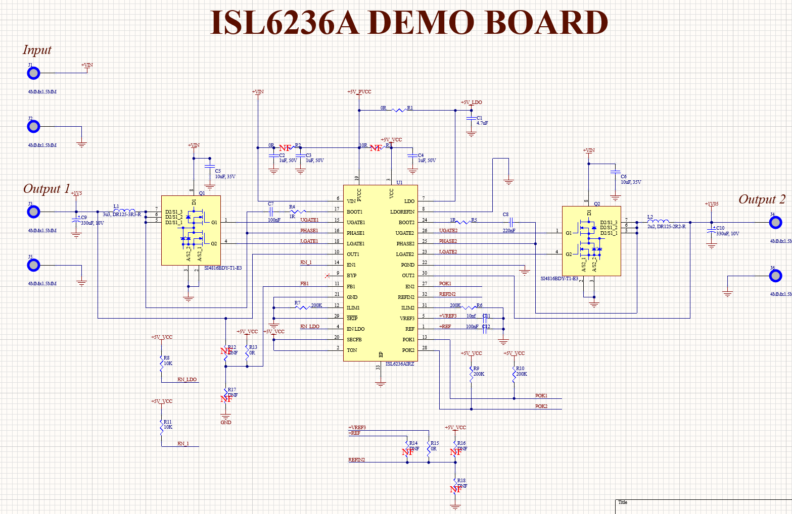

# ISL6236A Power Supply Design

An Altium Designer power supply project built around the **ISL6236AIRZ** controller, developed as part of my hardware design learning through **FEDEVEL Academy**.

The project documents a dual-output power supply schematic, local component libraries, and an ActiveBOM document. It brings together schematic capture, component data management, and footprint preparation in one editable Altium project.

## Schematic Preview

## Design Overview

The schematic includes two switching power stages with external MOSFETs, inductors, and output capacitors, together with the controller's supply, bootstrap, feedback, enable, and power-good connections.

| Item | Design detail |
| --- | --- |
| Main controller | ISL6236AIRZ |
| MOSFETs | SI4816BDY-T1-E3, Q1 and Q2 |
| Output 1 label | +1V5 — nominal 1.5 V target |
| Output 2 label | +1V05 — nominal 1.05 V target |
| Inductors | DR125-3R3-R, 3.3 µH; DR125-2R2-R, 2.2 µH |
| Design software | Altium Designer |

The output values above reflect the schematic labels; they are not measured performance results.

## Repository Contents

| File | Purpose |
| --- | --- |
| `PCB_Project.PrjPcb` | Main Altium project |
| `ISL6236A_DEMO.SchDoc` | Power supply schematic |
| `ISL6236A_DEMO.SchLib` | Local schematic symbol library and component parameters |
| `ISL6236A_DEMO.PcbLib` | Local PCB footprint library |
| `PCB_Project.BomDoc` | ActiveBOM document |
| `Pic/schematic/schematic_1.png` | Schematic preview |

## Skills Practiced

- Capturing a power supply schematic in Altium Designer.
- Working with controller, MOSFET, inductor, and passive-component symbols.
- Preparing and managing local schematic and PCB libraries.
- Recording manufacturer and supplier part numbers in component parameters.
- Organizing component information with ActiveBOM.
- Maintaining hardware design files with Git and GitHub.

## Opening the Project

1. Download or clone this repository.
2. Open `PCB_Project.PrjPcb` in Altium Designer.
3. Open `ISL6236A_DEMO.SchDoc` to inspect the circuit.
4. Open the `.SchLib` and `.PcbLib` files to inspect the component libraries.
5. Open `PCB_Project.BomDoc` to review the bill of materials.

Keep the project and its associated design files together so relative file references remain valid. The schematic preview above can be viewed without Altium Designer.

## Project Status

**In progress — schematic and component-library stage.**

The current repository includes the schematic, symbol and footprint libraries, and an ActiveBOM document. A PCB layout document (`.PcbDoc`), fabrication outputs, and hardware test results are not included in this version.

Next steps include PCB placement and routing, design-rule review, manufacturing-output preparation, and hardware validation.

## Acknowledgments

This is a course-based learning project developed while following FEDEVEL Academy training. Credit for the underlying course design and instructional material belongs to their respective authors. This repository documents my implementation and learning progress.

**Maintained by Feras Abuhaimed**
